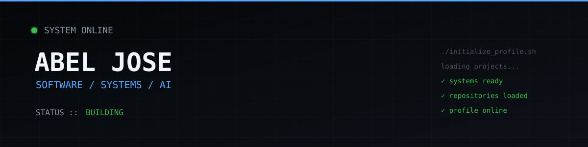

## Hi there!

  

  <code>BUILD → BREAK → UNDERSTAND → REBUILD</code>

<h2 align="center">⚡ CURRENT OPERATIONS</h2>

  Things I'm actually building, breaking, and rebuilding.

 

<table align="center">
<tr>

<td width="50%" valign="top">

### 🍳 RecipeStash

A full-stack recipe platform built around real user accounts, private data, and a production backend.

**Stack**

`React` `Django` `DRF` `PostgreSQL`

**Focus**

`REST API` · `Authentication` · `Full Stack`

</td>

<td width="50%" valign="top">

### 🕵️ Dark Pattern Detector

A browser-based project focused on identifying manipulative UI/UX patterns.

**Stack**

`HTML` `CSS` `JavaScript`

**Focus**

`Web` · `UX` · `Detection`

</td>

</tr>

<tr>

<td width="50%" valign="top">

### 🎓 My University Hub

A student-focused web project designed around university resources and information.

**Stack**

`Web Development`

**Focus**

`Students` · `Web` · `Product`

</td>

<td width="50%" valign="top">

### 🧪 More Experiments

Smaller projects, experiments and things I'm using to learn by actually building.

</td>

</tr>
</table>

